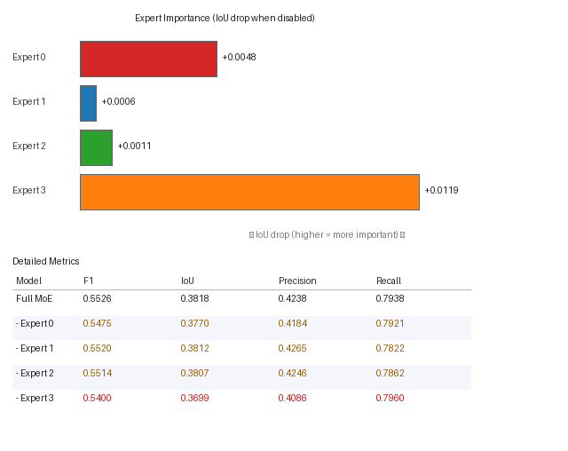

# Stage 5 — Expert Ablation Report

**Checkpoint**: `SECOND/stage5_6_dynamic/best_model.pt`  
**Ablation strategy**: `zero`  
**Validation samples**: 296  
**Validation tokens**: 57,426  

---

## Ablation Results

| Model | F1 | Change IoU | Precision | Recall | ΔF1 | ΔIoU | Load % |
|---|---|---|---|---|---|---|---|
| **Full MoE** | **0.5526** | **0.3818** | 0.4238 | 0.7938 | — | — | 100% |
| – Expert 0 | 0.5475 | 0.3770 | 0.4184 | 0.7921 | +0.0050 | +0.0048 🟡 | 24.4% |
| – Expert 1 | 0.5520 | 0.3812 | 0.4265 | 0.7822 | +0.0006 | +0.0006 🟢 | 24.4% |
| – Expert 2 | 0.5514 | 0.3807 | 0.4246 | 0.7862 | +0.0012 | +0.0011 🟢 | 24.8% |
| – Expert 3 | 0.5400 | 0.3699 | 0.4086 | 0.7960 | +0.0126 | +0.0119 🔴 | 26.3% |

> Legend: 🔴 significant drop (>0.01 IoU) · 🟡 minor drop · 🟢 negligible / improvement

---

## Expert Importance Ranking

_Ranked by IoU drop when expert is disabled._

| Rank | Expert | Importance (ΔIoU) | Load % | Verdict |
|---|---|---|---|---|
| 1 | Expert 3 | `+0.0119` | 26.3% | **Critical** — large performance drop |
| 2 | Expert 0 | `+0.0048` | 24.4% | **Moderate** — noticeable but small |
| 3 | Expert 2 | `+0.0011` | 24.8% | Marginal — near-zero contribution |
| 4 | Expert 1 | `+0.0006` | 24.4% | Marginal — near-zero contribution |

---

## Per-Expert Analysis

### Expert 0

| Metric | Full MoE | Without Expert 0 | Drop |
|---|---|---|---|
| F1       | 0.5526        | 0.5475  | `+0.0050` |
| IoU      | 0.3818       | 0.3770 | `+0.0048` |
| Precision| 0.4238 | 0.4184 | `+0.0054` |
| Recall   | 0.7938    | 0.7921 | `+0.0017` |

**Routing load**: 24.4% of tokens

**⚡ MODERATE**: Expert 0 contributes a small but measurable `0.0048` IoU gain. With 24.4% token load it handles a real sub-task, but may be mergeable with a similar expert.

### Expert 1

| Metric | Full MoE | Without Expert 1 | Drop |
|---|---|---|---|
| F1       | 0.5526        | 0.5520  | `+0.0006` |
| IoU      | 0.3818       | 0.3812 | `+0.0006` |
| Precision| 0.4238 | 0.4265 | `-0.0027` |
| Recall   | 0.7938    | 0.7822 | `+0.0116` |

**Routing load**: 24.4% of tokens

**✓ MARGINAL**: Expert 1 has near-zero individual impact (`+0.0006` IoU). Either:
  - Its specialization is replicated by another expert, OR
  - The tokens it handles are inherently easy to classify.
  Consider merging this expert or reducing `moe_expert_dim`.

### Expert 2

| Metric | Full MoE | Without Expert 2 | Drop |
|---|---|---|---|
| F1       | 0.5526        | 0.5514  | `+0.0012` |
| IoU      | 0.3818       | 0.3807 | `+0.0011` |
| Precision| 0.4238 | 0.4246 | `-0.0008` |
| Recall   | 0.7938    | 0.7862 | `+0.0076` |

**Routing load**: 24.8% of tokens

**✓ MARGINAL**: Expert 2 has near-zero individual impact (`+0.0011` IoU). Either:
  - Its specialization is replicated by another expert, OR
  - The tokens it handles are inherently easy to classify.
  Consider merging this expert or reducing `moe_expert_dim`.

### Expert 3

| Metric | Full MoE | Without Expert 3 | Drop |
|---|---|---|---|
| F1       | 0.5526        | 0.5400  | `+0.0126` |
| IoU      | 0.3818       | 0.3699 | `+0.0119` |
| Precision| 0.4238 | 0.4086 | `+0.0152` |
| Recall   | 0.7938    | 0.7960 | `-0.0021` |

**Routing load**: 26.3% of tokens

**⚠️ CRITICAL**: Removing Expert 3 causes a `0.0119` IoU drop (`0.0126` F1 drop). This expert handles 26.3% of tokens and provides an irreplaceable specialization. Its capacity should be preserved or even expanded.

---

## Interpretation & Recommendations

**Most critical expert**: Expert 3 (ΔIoU = `+0.0119`, load 26.3%)

**Least critical expert**: Expert 1 (ΔIoU = `+0.0006`, load 24.4%)

### Summary Breakdown

- **Critical experts** (ΔIoU > 0.01): 1/4
- **Moderate experts** (0.002 < ΔIoU ≤ 0.01): 1/4
- **Marginal experts** (ΔIoU ≈ 0): 2/4
- **Redundant experts** (ΔIoU < -0.002, removal helps): 0/4

**Recommendation**: More than half the experts are marginal or redundant. Consider:
1. Reducing to 2 experts (halved compute)
2. Increasing `expert_dropout_prob` to force non-overlapping specialization
3. Adding an explicit diversity loss on expert outputs
4. Using `use_top2=True` to allow partial contributions from multiple experts

---

_Generated by `run_expert_ablation.py`_
