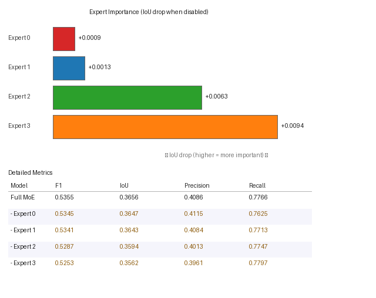

# Stage 5 — Expert Ablation Report

**Checkpoint**: `SECOND/stage5_6_semantic/best_model.pt`  
**Ablation strategy**: `zero`  
**Validation samples**: 296  
**Validation tokens**: 57,426  

---

## Ablation Results

| Model | F1 | Change IoU | Precision | Recall | ΔF1 | ΔIoU | Load % |
|---|---|---|---|---|---|---|---|
| **Full MoE** | **0.5355** | **0.3656** | 0.4086 | 0.7766 | — | — | 100% |
| – Expert 0 | 0.5345 | 0.3647 | 0.4115 | 0.7625 | +0.0010 | +0.0009 🟢 | 24.9% |
| – Expert 1 | 0.5341 | 0.3643 | 0.4084 | 0.7713 | +0.0014 | +0.0013 🟢 | 25.1% |
| – Expert 2 | 0.5287 | 0.3594 | 0.4013 | 0.7747 | +0.0067 | +0.0063 🟡 | 24.0% |
| – Expert 3 | 0.5253 | 0.3562 | 0.3961 | 0.7797 | +0.0102 | +0.0094 🟡 | 26.1% |

> Legend: 🔴 significant drop (>0.01 IoU) · 🟡 minor drop · 🟢 negligible / improvement

---

## Expert Importance Ranking

_Ranked by IoU drop when expert is disabled._

| Rank | Expert | Importance (ΔIoU) | Load % | Verdict |
|---|---|---|---|---|
| 1 | Expert 3 | `+0.0094` | 26.1% | **Moderate** — noticeable but small |
| 2 | Expert 2 | `+0.0063` | 24.0% | **Moderate** — noticeable but small |
| 3 | Expert 1 | `+0.0013` | 25.1% | Marginal — near-zero contribution |
| 4 | Expert 0 | `+0.0009` | 24.9% | Marginal — near-zero contribution |

---

## Per-Expert Analysis

### Expert 0

| Metric | Full MoE | Without Expert 0 | Drop |
|---|---|---|---|
| F1       | 0.5355        | 0.5345  | `+0.0010` |
| IoU      | 0.3656       | 0.3647 | `+0.0009` |
| Precision| 0.4086 | 0.4115 | `-0.0029` |
| Recall   | 0.7766    | 0.7625 | `+0.0142` |

**Routing load**: 24.9% of tokens

**✓ MARGINAL**: Expert 0 has near-zero individual impact (`+0.0009` IoU). Either:
  - Its specialization is replicated by another expert, OR
  - The tokens it handles are inherently easy to classify.
  Consider merging this expert or reducing `moe_expert_dim`.

### Expert 1

| Metric | Full MoE | Without Expert 1 | Drop |
|---|---|---|---|
| F1       | 0.5355        | 0.5341  | `+0.0014` |
| IoU      | 0.3656       | 0.3643 | `+0.0013` |
| Precision| 0.4086 | 0.4084 | `+0.0002` |
| Recall   | 0.7766    | 0.7713 | `+0.0054` |

**Routing load**: 25.1% of tokens

**✓ MARGINAL**: Expert 1 has near-zero individual impact (`+0.0013` IoU). Either:
  - Its specialization is replicated by another expert, OR
  - The tokens it handles are inherently easy to classify.
  Consider merging this expert or reducing `moe_expert_dim`.

### Expert 2

| Metric | Full MoE | Without Expert 2 | Drop |
|---|---|---|---|
| F1       | 0.5355        | 0.5287  | `+0.0067` |
| IoU      | 0.3656       | 0.3594 | `+0.0063` |
| Precision| 0.4086 | 0.4013 | `+0.0073` |
| Recall   | 0.7766    | 0.7747 | `+0.0019` |

**Routing load**: 24.0% of tokens

**⚡ MODERATE**: Expert 2 contributes a small but measurable `0.0063` IoU gain. With 24.0% token load it handles a real sub-task, but may be mergeable with a similar expert.

### Expert 3

| Metric | Full MoE | Without Expert 3 | Drop |
|---|---|---|---|
| F1       | 0.5355        | 0.5253  | `+0.0102` |
| IoU      | 0.3656       | 0.3562 | `+0.0094` |
| Precision| 0.4086 | 0.3961 | `+0.0125` |
| Recall   | 0.7766    | 0.7797 | `-0.0030` |

**Routing load**: 26.1% of tokens

**⚡ MODERATE**: Expert 3 contributes a small but measurable `0.0094` IoU gain. With 26.1% token load it handles a real sub-task, but may be mergeable with a similar expert.

---

## Interpretation & Recommendations

**Most critical expert**: Expert 3 (ΔIoU = `+0.0094`, load 26.1%)

**Least critical expert**: Expert 0 (ΔIoU = `+0.0009`, load 24.9%)

### Summary Breakdown

- **Critical experts** (ΔIoU > 0.01): 0/4
- **Moderate experts** (0.002 < ΔIoU ≤ 0.01): 2/4
- **Marginal experts** (ΔIoU ≈ 0): 2/4
- **Redundant experts** (ΔIoU < -0.002, removal helps): 0/4

**Recommendation**: More than half the experts are marginal or redundant. Consider:
1. Reducing to 2 experts (halved compute)
2. Increasing `expert_dropout_prob` to force non-overlapping specialization
3. Adding an explicit diversity loss on expert outputs
4. Using `use_top2=True` to allow partial contributions from multiple experts

---

_Generated by `run_expert_ablation.py`_
