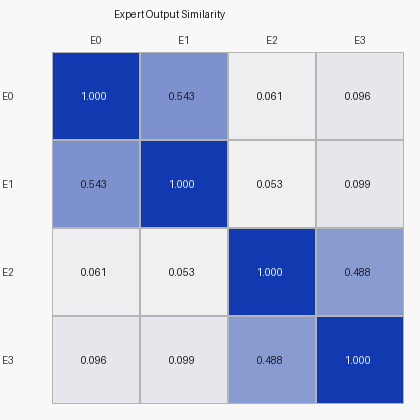
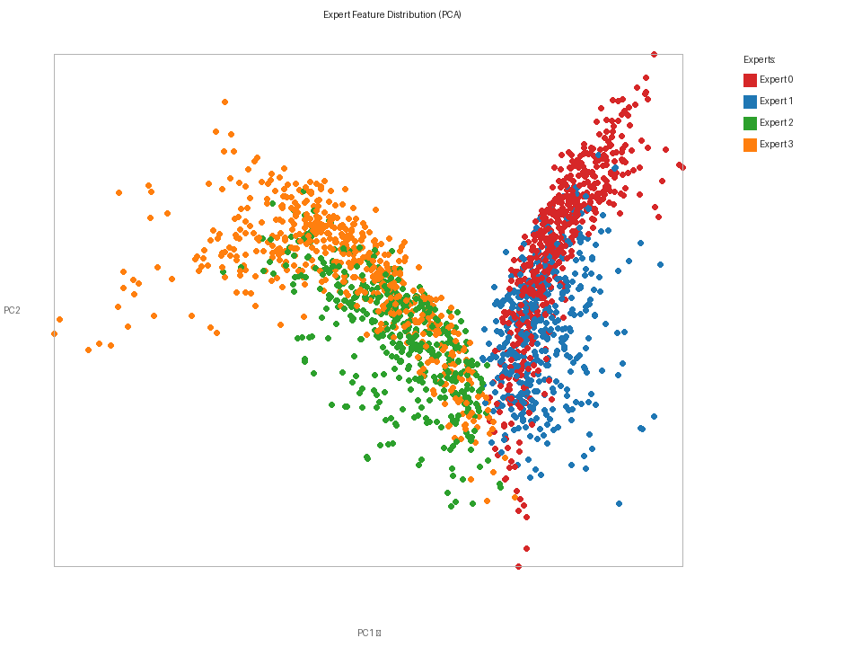
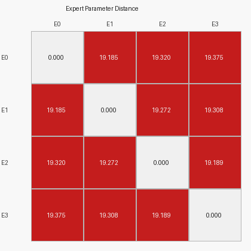
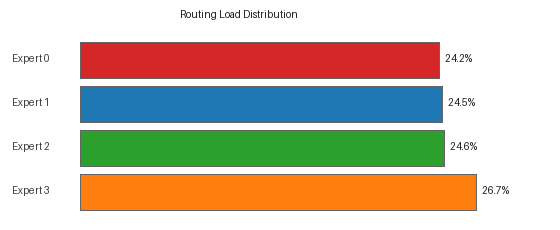
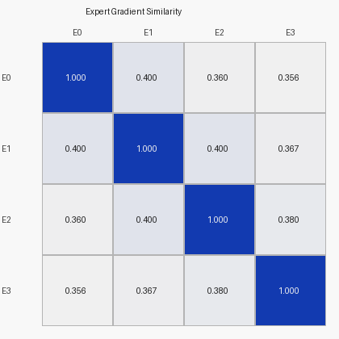

# Expert Diversity Report

**Status: ✓ STABLE**

| Metric | Value |
|---|---|
| Mean Off-Diagonal Output Similarity | `0.2233` |
| Mean Gradient Similarity             | `0.3770` |
| Mean Router Entropy                  | `0.0584` |
| Normalized Entropy (0→1)             | `0.042` |
| Total Tokens Analyzed                | `38,939` |

---

## Test 1 — Expert Output Similarity

_Same tokens forced through every expert; cosine similarity of normalized output vectors._

| | E0 | E1 | E2 | E3 |
|---|---|---|---|---|
| E0 | 1.0000 | 0.5429 | 0.0614 | 0.0957 |
| E1 | 0.5429 | 1.0000 | 0.0527 | 0.0993 |
| E2 | 0.0614 | 0.0527 | 1.0000 | 0.4880 |
| E3 | 0.0957 | 0.0993 | 0.4880 | 1.0000 |

**✓ GOOD:** Mean similarity `0.223` < `0.6` → experts are functionally diverse.

## Test 2 — Expert Feature Distribution (PCA)

Expert output embeddings projected to 2D via PCA. Overlapping clusters indicate experts produce similar representations.

## Test 3 — Routing Entropy

| Metric | Value | Note |
|---|---|---|
| Mean per-token entropy | `0.0584` | Maximum possible: `1.3863` |
| Normalized entropy     | `0.042` | 0 = fully collapsed, 1 = uniform |

**Sharp routing** — the router assigns each token to one expert with >95% confidence. Decision boundaries are well-formed.

## Test 4 — Expert Parameter Distance

_L2 distance between `expert[i].net[0].weight` and `expert[j].net[0].weight`._

| | E0 | E1 | E2 | E3 |
|---|---|---|---|---|
| E0 | 0.00 | 19.18 | 19.32 | 19.38 |
| E1 | 19.18 | 0.00 | 19.27 | 19.31 |
| E2 | 19.32 | 19.27 | 0.00 | 19.19 |
| E3 | 19.38 | 19.31 | 19.19 | 0.00 |

Min non-diagonal distance: `19.18`, Mean: `19.27`.
 **Healthy weight-space separation.**

## Test 5 — Expert Change Sensitivity

| Expert | Tokens Routed | Load % | Avg Change Prob | Role |
|---|---|---|---|---|
| Expert 0 | 9,433 | 24.2% | 0.4489 | Change processor (high) |
| Expert 1 | 9,523 | 24.5% | 0.2038 | Stability validator (low) |
| Expert 2 | 9,584 | 24.6% | 0.2027 | Stability validator (low) |
| Expert 3 | 10,399 | 26.7% | 0.4379 | Change processor (high) |

## Test 6 — Gradient Similarity

_Each expert's gradient `∂(mean(E_i(x)²)) / ∂W_i¹` computed on the same token batch (forced dispatch). Cosine similarity of flattened gradient vectors._

| | E0 | E1 | E2 | E3 |
|---|---|---|---|---|
| E0 | 1.0000 | 0.3997 | 0.3600 | 0.3558 |
| E1 | 0.3997 | 1.0000 | 0.4001 | 0.3670 |
| E2 | 0.3600 | 0.4001 | 1.0000 | 0.3795 |
| E3 | 0.3558 | 0.3670 | 0.3795 | 1.0000 |

**✓ GOOD:** Gradient similarity `0.377` → experts learn distinct parameter updates.

---

## Overall Judgment

**No collapse detected.** Experts are functionally diverse (output_sim=`0.223`, grad_sim=`0.377`).

**Hidden task-level specialization detected:**

- Change processors (avg change_prob > 0.35): Expert 0, Expert 3
- Stability validators (avg change_prob ≤ 0.35): Expert 1, Expert 2

Even without class-level purity, experts have specialized around the **task structure** (detecting change vs. confirming stability).

## Improvement Suggestions

No collapse. Possible further improvements:

1. **Imbalance-aware routing**: if all experts are dominated by one class (e.g., `low_veg`), remove the load-balance loss and switch to class-weighted expert assignment.
2. **Early semantic injection**: fuse class one-hot embeddings into `TokenEncoder` at Stage 1, not just the MoE router, so the entire network benefits from semantic context.
3. **Top-2 routing** (`use_top2=True`): let each token blend two expert outputs — smoother gradient flow, better utilization of all experts.
4. **Longer training**: 30 epochs may not be enough for specialization to emerge fully. Consider 50–100 epochs with a lower learning rate.

