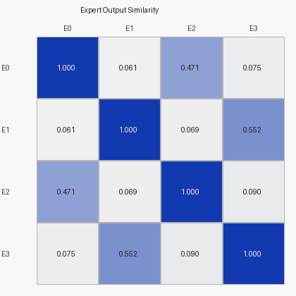
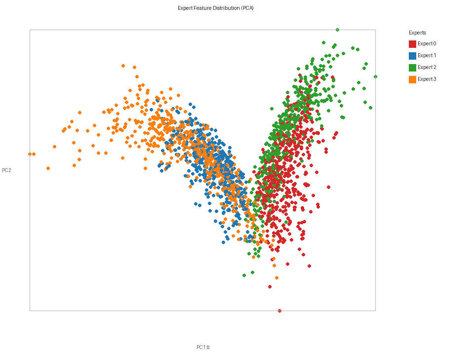
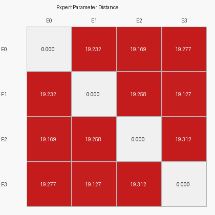
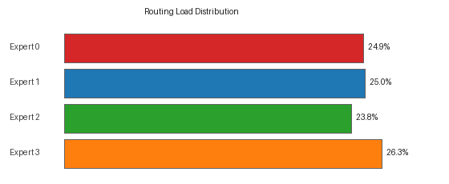
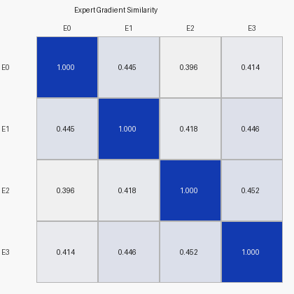

# Expert Diversity Report

**Status: ✓ STABLE**

| Metric | Value |
|---|---|
| Mean Off-Diagonal Output Similarity | `0.2197` |
| Mean Gradient Similarity             | `0.4282` |
| Mean Router Entropy                  | `0.0600` |
| Normalized Entropy (0→1)             | `0.043` |
| Total Tokens Analyzed                | `38,939` |

---

## Test 1 — Expert Output Similarity

_Same tokens forced through every expert; cosine similarity of normalized output vectors._

| | E0 | E1 | E2 | E3 |
|---|---|---|---|---|
| E0 | 1.0000 | 0.0614 | 0.4711 | 0.0751 |
| E1 | 0.0614 | 1.0000 | 0.0689 | 0.5519 |
| E2 | 0.4711 | 0.0689 | 1.0000 | 0.0896 |
| E3 | 0.0751 | 0.5519 | 0.0896 | 1.0000 |

**✓ GOOD:** Mean similarity `0.220` < `0.6` → experts are functionally diverse.

## Test 2 — Expert Feature Distribution (PCA)

Expert output embeddings projected to 2D via PCA. Overlapping clusters indicate experts produce similar representations.

## Test 3 — Routing Entropy

| Metric | Value | Note |
|---|---|---|
| Mean per-token entropy | `0.0600` | Maximum possible: `1.3863` |
| Normalized entropy     | `0.043` | 0 = fully collapsed, 1 = uniform |

**Sharp routing** — the router assigns each token to one expert with >95% confidence. Decision boundaries are well-formed.

## Test 4 — Expert Parameter Distance

_L2 distance between `expert[i].net[0].weight` and `expert[j].net[0].weight`._

| | E0 | E1 | E2 | E3 |
|---|---|---|---|---|
| E0 | 0.00 | 19.23 | 19.17 | 19.28 |
| E1 | 19.23 | 0.00 | 19.26 | 19.13 |
| E2 | 19.17 | 19.26 | 0.00 | 19.31 |
| E3 | 19.28 | 19.13 | 19.31 | 0.00 |

Min non-diagonal distance: `19.13`, Mean: `19.23`.
 **Healthy weight-space separation.**

## Test 5 — Expert Change Sensitivity

| Expert | Tokens Routed | Load % | Avg Change Prob | Role |
|---|---|---|---|---|
| Expert 0 | 9,677 | 24.9% | 0.2114 | Stability validator (low) |
| Expert 1 | 9,727 | 25.0% | 0.2453 | Stability validator (low) |
| Expert 2 | 9,278 | 23.8% | 0.4380 | Change processor (high) |
| Expert 3 | 10,257 | 26.3% | 0.4280 | Change processor (high) |

## Test 6 — Gradient Similarity

_Each expert's gradient `∂(mean(E_i(x)²)) / ∂W_i¹` computed on the same token batch (forced dispatch). Cosine similarity of flattened gradient vectors._

| | E0 | E1 | E2 | E3 |
|---|---|---|---|---|
| E0 | 1.0000 | 0.4450 | 0.3957 | 0.4136 |
| E1 | 0.4450 | 1.0000 | 0.4176 | 0.4456 |
| E2 | 0.3957 | 0.4176 | 1.0000 | 0.4517 |
| E3 | 0.4136 | 0.4456 | 0.4517 | 1.0000 |

**✓ GOOD:** Gradient similarity `0.428` → experts learn distinct parameter updates.

## Bonus — Expert × Semantic Class Distribution

| Expert | background | water | soil/imp | vegetation | building | farmland | low_veg |
|---|---|---|---|---|---|---|---|
| Expert 0 | 0 (0%) | 0 (0%) | 0 (0%) | 0 (0%) | 0 (0%) | 0 (0%) | 9677 (100%) |
| Expert 1 | 0 (0%) | 0 (0%) | 0 (0%) | 0 (0%) | 0 (0%) | 0 (0%) | 9727 (100%) |
| Expert 2 | 0 (0%) | 0 (0%) | 0 (0%) | 0 (0%) | 0 (0%) | 0 (0%) | 9278 (100%) |
| Expert 3 | 0 (0%) | 0 (0%) | 0 (0%) | 0 (0%) | 0 (0%) | 0 (0%) | 10257 (100%) |

---

## Overall Judgment

**No collapse detected.** Experts are functionally diverse (output_sim=`0.220`, grad_sim=`0.428`).

**Hidden task-level specialization detected:**

- Change processors (avg change_prob > 0.35): Expert 2, Expert 3
- Stability validators (avg change_prob ≤ 0.35): Expert 0, Expert 1

Even without class-level purity, experts have specialized around the **task structure** (detecting change vs. confirming stability).

## Improvement Suggestions

No collapse. Possible further improvements:

1. **Imbalance-aware routing**: if all experts are dominated by one class (e.g., `low_veg`), remove the load-balance loss and switch to class-weighted expert assignment.
2. **Early semantic injection**: fuse class one-hot embeddings into `TokenEncoder` at Stage 1, not just the MoE router, so the entire network benefits from semantic context.
3. **Top-2 routing** (`use_top2=True`): let each token blend two expert outputs — smoother gradient flow, better utilization of all experts.
4. **Longer training**: 30 epochs may not be enough for specialization to emerge fully. Consider 50–100 epochs with a lower learning rate.

