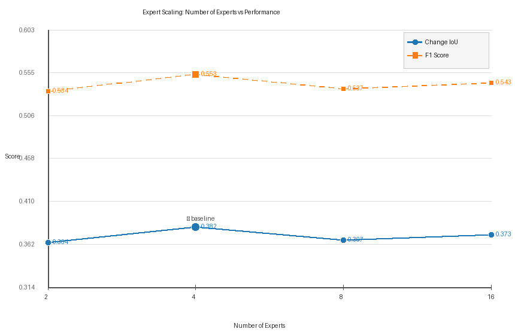

# Expert Scaling Experiment Report

**Router version**: `v1`  
**Expert dim** (D_exp): `512`  
**Hidden dim** (H): `384`  
**Validation samples**: 296  

---

## Results Table

| Experts | F1 | Change IoU | Precision | Recall | ΔIoU vs E4 | MoE Params (M) |
|---|---|---|---|---|---|---|
| **2** | 0.5339 | 0.3642 | 0.4056 | 0.7809 | `-0.0176` | 0.79 |
| **4** ← baseline | 0.5526 **★** | 0.3818 **★** | 0.4238 | 0.7938 | `+0.0000` | 1.58 |
| **8** | 0.5368 | 0.3669 | 0.4049 | 0.7962 | `-0.0149` | 3.18 |
| **16** | 0.5435 | 0.3731 | 0.4100 | 0.8060 | `-0.0086` | 6.40 |

> ★ = best value across all configurations

---

## Expert Importance (IoU improvement vs E=2)

| Experts | ΔIoU vs E=2 | ΔF1 vs E=2 |
|---|---|---|
| 2 | `+0.0000` | `+0.0000` |
| 4 | `+0.0176` | `+0.0187` |
| 8 | `+0.0027` | `+0.0029` |
| 16 | `+0.0090` | `+0.0096` |

## Analysis

### 1. Does performance increase with more experts?

**Non-monotonic.** Performance peaks at E=4 (IoU=0.3818), then increases with 16 experts.

### 2. Does performance saturate?

**Partial saturation.** IoU range across configs is `0.0176` — small but detectable. Going from E=2 to E=4 provides real gains, but further increases yield diminishing returns.

### 3. Can too many experts hurt performance?

**Marginally** or not at all. The highest expert count (E=16, IoU=0.3731) does not significantly underperform E=8 (IoU=0.3669). The architecture scales gracefully, though the gains are diminishing.

### 4. Recommendation

**E=4 (baseline) is optimal** for this dataset and training schedule. Increasing to 8 or 16 experts adds parameters without proportional performance gain.  

**Suggestion**: Instead of more experts, try:
- Larger `moe_expert_dim` (512 → 1024) to give each expert more capacity
- `use_top2=True` to allow soft expert blending
- More epochs (current 60 may not be enough for E=16)

### 5. Compute-Performance Tradeoff

| Experts | MoE Params (M) | Relative cost | IoU gain vs E=2 |
|---|---|---|---|
| 2 | 0.79M | ×1.0 | `+0.0000` |
| 4 | 1.58M | ×2.0 | `+0.0176` |
| 8 | 3.15M | ×4.0 | `+0.0027` |
| 16 | 6.31M | ×8.0 | `+0.0090` |

---

_Generated by `run_expert_scaling.py`_
